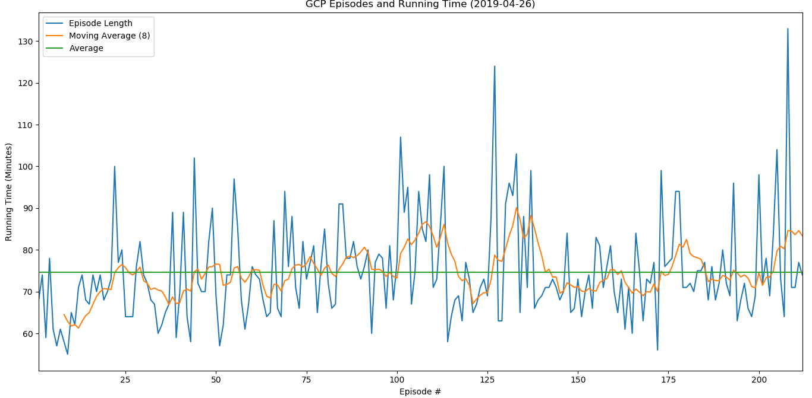

# GCPStats

This program pulls the Glass Cannon Podcast running time off of an RSS feed and visualizes individual episode times, the average time, and a moving average over 10 episodes in a bar graph using Pandas.

### Example

