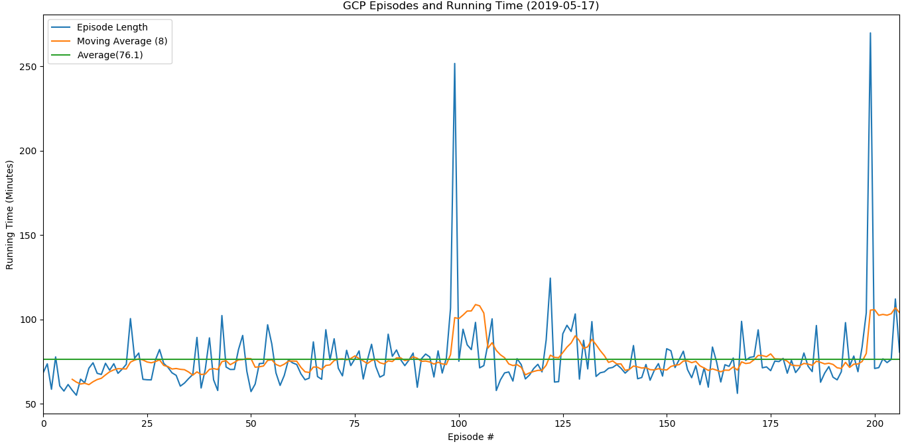
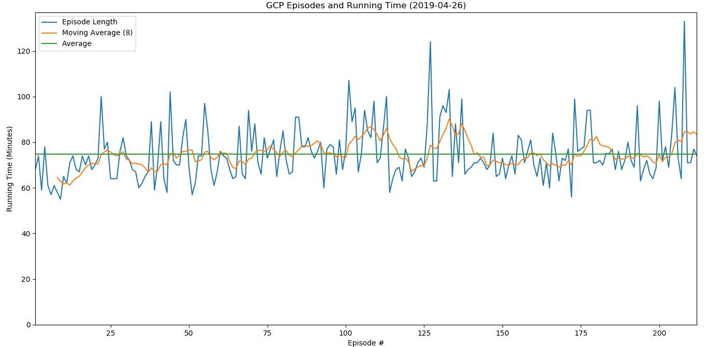

# GCPStats

This program pulls the Glass Cannon Podcast running time off of an RSS feed and visualizes individual episode times, the average time, and a moving average over 10 episodes in a line graph using Pandas.

This was made for a Reddit post at: https://www.reddit.com/r/TheGlassCannonPodcast/comments/bh7yzc/heres_a_bar_graph_of_all_gcp_episodes_and_their/

### Examples
### (Updated) Regular graph

#### (old) Regular graph:

#### Graph with y-axis starting at 0:

